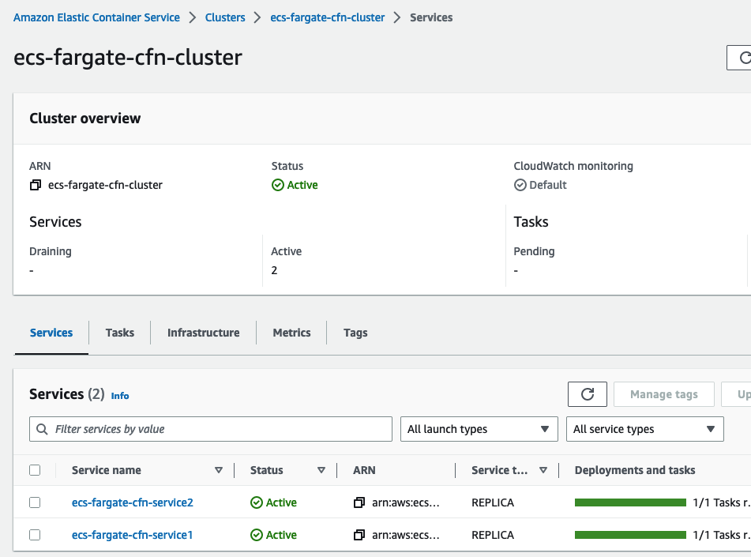
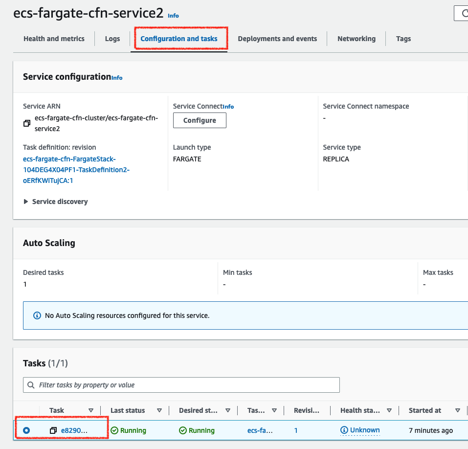
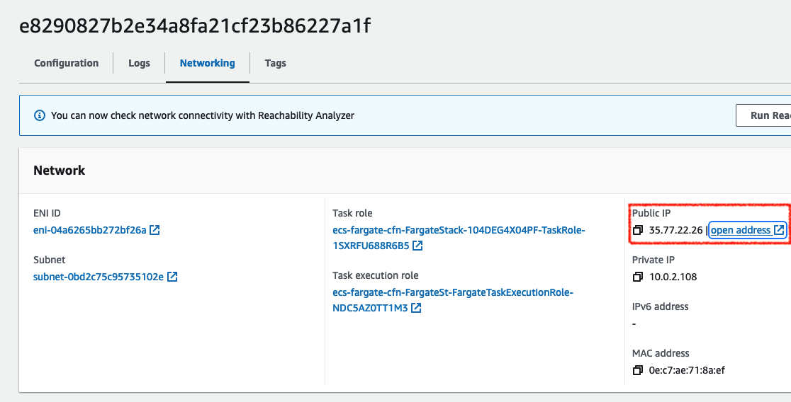
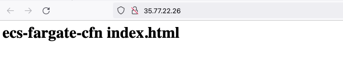
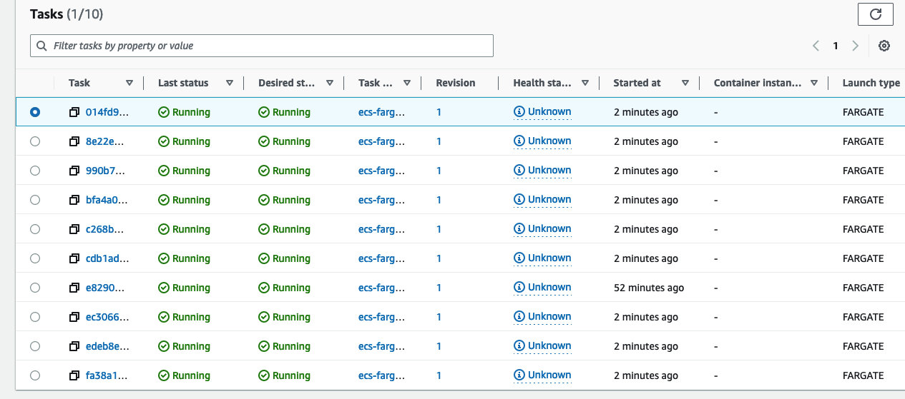
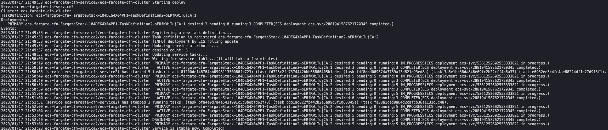
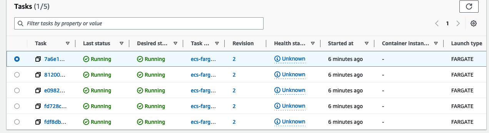

# ecs-fargate-cfn

Test project for ecs fargate. The code in this repository is largely based on [awstut-fa](https://github.com/awstut-an-r/awstut-fa/tree/main/018) (relevant [article](https://awstut.com/en/2022/01/25/introduction-to-fargate-with-cloudformation/)).

<!-- TOC -->

- [ecs-fargate-cfn](#ecs-fargate-cfn)
	- [Deploy ECS cluster via Cloudformation](#deploy-ecs-cluster-via-cloudformation)
		- [Architecture](#architecture)
		- [Requirements](#requirements)
		- [Tempalte File Modification](#tempalte-file-modification)
		- [Upload  Template Files to S3 Bucket](#upload--template-files-to-s3-bucket)
		- [CloudFormation Stack Creation](#cloudformation-stack-creation)
			- [Create ECR stack](#create-ecr-stack)
			- [Push Image to ECR Repository](#push-image-to-ecr-repository)
			- [Create other stacks to run ECS fargate tasks](#create-other-stacks-to-run-ecs-fargate-tasks)
	- [Update ECS cluster via ecspresso](#update-ecs-cluster-via-ecspresso)
		- [Install ecspresso](#install-ecspresso)
		- [Export the code for an existing ECS service](#export-the-code-for-an-existing-ecs-service)
		- [Scale out / Scale in the ECS service](#scale-out--scale-in-the-ecs-service)
			- [Scale out](#scale-out)
			- [Scale in](#scale-in)
			- [Deploy from the config file](#deploy-from-the-config-file)
			- [Rollback](#rollback)

<!-- /TOC -->

## Deploy ECS cluster via Cloudformation

### Architecture


### Requirements

* AWS CLI
* S3 Bucket(Here, the bucket name is *my-bucket* and region is *ap-northeast-1*)

### Tempalte File Modification

Modify the following locations in fa-018.yaml.

```yaml
Parameters:
  TemplateBucketName:
    Type: String
    Default: my-ecs-fargate-cfn-template
```

### Upload  Template Files to S3 Bucket

```bash
export BUCKET_NAME=my-ecs-fargate-cfn-template

# Create s3 Bucket
aws s3api create-bucket --bucket ${BUCKET_NAME} \
    --region ap-northeast-1 --create-bucket-configuration LocationConstraint=ap-northeast-1

# Upload Cfn template files to s3 bucket
cd cloudformation
aws s3 cp . s3://${BUCKET_NAME}/ecs-fargate-cfn/ --recursive
```

### CloudFormation Stack Creation

#### Create ECR stack

```bash
aws cloudformation create-stack \
--stack-name ecs-fargate-cfn-ecr \
--template-url https://${BUCKET_NAME}.s3.ap-northeast-1.amazonaws.com/ecs-fargate-cfn/ecr.yaml
```

#### Push Image to ECR Repository

```bash
export AWS_ACCOUNT_ID=$(aws sts get-caller-identity --query "Account" --output text)
aws ecr get-login-password --region ap-northeast-1 | docker login --username AWS --password-stdin ${AWS_ACCOUNT_ID}.dkr.ecr.ap-northeast-1.amazonaws.com

cd task

docker build -t ecs-fargate-cfn .

docker tag ecs-fargate-cfn:latest ${AWS_ACCOUNT_ID}.dkr.ecr.ap-northeast-1.amazonaws.com/ecs-fargate-cfn:latest
```

Check if the container image that you've built can work as expected

```
docker run -d -p 8888:80 ${AWS_ACCOUNT_ID}.dkr.ecr.ap-northeast-1.amazonaws.com/ecs-fargate-cfn   
curl localhost:8888
```

Here is an expected output:

```
<html>
  <head>
  </head>
  <body>
    <h1>ecs-fargate-cfn index.html</h1>
  </body>
</html>
```

Finally push the image to the ECR

```bash
docker push ${AWS_ACCOUNT_ID}.dkr.ecr.ap-northeast-1.amazonaws.com/ecs-fargate-cfn:latest
```

#### Create other stacks to run ECS fargate tasks

```bash
aws cloudformation create-stack \
--stack-name ecs-fargate-cfn \
--template-url https://${BUCKET_NAME}.s3.ap-northeast-1.amazonaws.com/ecs-fargate-cfn/main.yaml \
--capabilities CAPABILITY_IAM
```

After checking the resources for each stack, the information for the main resources created this time is as follows

- ECS cluster: `ecs-fargate-cfn-cluster`
- ECS service 1 name: `ecs-fargate-cfn-service1`
- ECS service 2 name: `ecs-fargate-cfn-service2`

You can see that there are two services running in the cluster.



Check the details of the tasks running on each service.



You can find PublicIP for each task



Finally access the IP, you'll see the page like this




## Update ECS cluster via ecspresso

Let's update the ECS service that you've deployed using [ecspresso](https://github.com/kayac/ecspresso)
### Install ecspresso
```
brew install kayac/tap/ecspresso
```
### Export the code for an existing ECS service

```bash
export ECS_CLUSTER_NAME=ecs-fargate-cfn-cluster
export ECS_SERVICE_NAME=ecs-fargate-cfn-service2
ecspresso init --region ap-northeast-1 --cluster ${ECS_CLUSTER_NAME} --service ${ECS_SERVICE_NAME} --config ecspresso.yml
```

output would be like this

```
2023/01/17 21:30:51 ecs-fargate-cfn-service2/ecs-fargate-cfn-cluster save service definition to ecs-service-def.json
2023/01/17 21:30:51 ecs-fargate-cfn-service2/ecs-fargate-cfn-cluster save task definition to ecs-task-def.json
2023/01/17 21:30:51 ecs-fargate-cfn-service2/ecs-fargate-cfn-cluster save config to ecspresso.yml
```

You'll see the generated files `ecspresso.yml`, `ecs-service-def.json`, and `ecs-task-def.json`.

```bash
ls -1

ecs-service-def.json
ecs-task-def.json
ecspresso.yml
```

Now you are ready to deploy the service by ecspresso!

### Scale out / Scale in the ECS service

Check the current container number for the task using `ecspresso status` command

```
ecspresso  status --config ecspresso.yml 

Service: ecs-fargate-cfn-service2
Cluster: ecs-fargate-cfn-cluster
TaskDefinition: ecs-fargate-cfn-FargateStack-104DEG4X04PF1-TaskDefinition2-oERfKWiTujCA:1
Deployments:
   PRIMARY ecs-fargate-cfn-FargateStack-104DEG4X04PF1-TaskDefinition2-oERfKWiTujCA:1 desired:1 pending:0 running:1 COMPLETED(ECS deployment ecs-svc/2881941587621720345 completed.)
```

You can see the task named `ecs-fargate-cfn-FargateStack-104DEG4X04PF1-TaskDefinition2-oERfKWiTujCA:1` has `1` container running.

#### Scale out

So let's scale it out to `10` containers

```
ecspresso deploy --config ecspresso.yml --tasks 10 --skip-task-definition
```

The point here is the `--skip-task-definition` option. If you run without this option, you can still scale out the container, but the revision will go up by one. As for how to use it, I think it's good to use it when you want to start additional new containers, but for scale-out purposes where tests are not completed or sudden access is expected, `--skip-task-definiton` is specified to scale out. 

Output would be like this

```
2023/01/17 21:42:52 ecs-fargate-cfn-service2/ecs-fargate-cfn-cluster Starting deploy 
Service: ecs-fargate-cfn-service2
Cluster: ecs-fargate-cfn-cluster
TaskDefinition: ecs-fargate-cfn-FargateStack-104DEG4X04PF1-TaskDefinition2-oERfKWiTujCA:1
Deployments:
   PRIMARY ecs-fargate-cfn-FargateStack-104DEG4X04PF1-TaskDefinition2-oERfKWiTujCA:1 desired:1 pending:0 running:1 COMPLETED(ECS deployment ecs-svc/2881941587621720345 completed.)
Events:
2023/01/17 21:42:52 ecs-fargate-cfn-service2/ecs-fargate-cfn-cluster service attributes will not change
2023/01/17 21:42:52 ecs-fargate-cfn-service2/ecs-fargate-cfn-cluster desired count: 10
2023/01/17 21:42:52 ecs-fargate-cfn-service2/ecs-fargate-cfn-cluster Updating service tasks...
2023/01/17 21:42:55 ecs-fargate-cfn-service2/ecs-fargate-cfn-cluster Waiting for service stable...(it will take a few minutes)
2023/01/17 21:43:05 ecs-fargate-cfn-service2/ecs-fargate-cfn-cluster  PRIMARY ecs-fargate-cfn-FargateStack-104DEG4X04PF1-TaskDefinition2-oERfKWiTujCA:1 desired:10 pending:0 running:1 COMPLETED(ECS deployment ecs-svc/2881941587621720345 completed.)
2023/01/17 21:43:07 (service ecs-fargate-cfn-service2) has started 9 tasks: (task 8e22e10e878c45deaa383472f1ee63c4) (task fa38a1cad9a64d2cafcb36a1131d5c48) (task edeb8e4c4ddc4ece84f9644c92aca9cb) (task bfa4a0d7a4a5431991c5c8bebfd62f78) (task 990b747128b1495182a2f630cf7b7e64) (task cdb1ad322fb442b2a5a99d3f1068345a) (task 014fd9e769424826b5fd785d5d33884a) (task ec3066b722be4ca7aad7a1fec2af2592) (task c268b8b99e264bbb92e3e106e97c469a).2023/01/17 21:43:15 ecs-fargate-cfn-service2/ecs-fargate-cfn-cluster  PRIMARY ecs-fargate-cfn-FargateStack-104DEG4X04PF1-TaskDefinition2-oERfKWiTujCA:1 desired:10 pending:9 running:1 COMPLETED(ECS deployment ecs-svc/2881941587621720345 completed.)2023/01/17 21:43:25 ecs-fargate-cfn-service2/ecs-fargate-cfn-cluster  PRIMARY ecs-fargate-cfn-FargateStack-104DEG4X04PF1-TaskDefinition2-oERfKWiTujCA:1 desired:10 pending:3 running:7 COMPLETED(ECS deployment ecs-svc/2881941587621720345 completed.)
2023/01/17 21:43:34 ecs-fargate-cfn-service2/ecs-fargate-cfn-cluster Service is stable now. Completed!
```

Check the status agagin, then you'll see the task scaled out to 10 containers

```
ecspresso  status --config ecspresso.yml                               

Service: ecs-fargate-cfn-service2
Cluster: ecs-fargate-cfn-clusterTaskDefinition: ecs-fargate-cfn-FargateStack-104DEG4X04PF1-TaskDefinition2-oERfKWiTujCA:1
Deployments:
   PRIMARY ecs-fargate-cfn-FargateStack-104DEG4X04PF1-TaskDefinition2-oERfKWiTujCA:1 desired:10 pending:0 running:10 COMPLETED(ECS deployment ecs-svc/2881941587621720345 completed.)
```

AWS console view:



#### Scale in

Then let's scale it in to 3 containers

```
ecspresso deploy --config ecspresso.yml --tasks 3 --skip-task-definition
```

Check the status, then you'll see the task scaled in to 3 containers

```
ecspresso  status --config ecspresso.yml

Service: ecs-fargate-cfn-service2
Cluster: ecs-fargate-cfn-clusterTaskDefinition: ecs-fargate-cfn-FargateStack-104DEG4X04PF1-TaskDefinition2-oERfKWiTujCA:1
Deployments:
   PRIMARY ecs-fargate-cfn-FargateStack-104DEG4X04PF1-TaskDefinition2-oERfKWiTujCA:1 desired:3 pending:0 running:3 COMPLETED(ECS deployment ecs-svc/2881941587621720345 completed.)
```

#### Deploy from the config file

Update `ecs-service-def.json` to increase `desiredCount` from 3 to 5

```
vi ecs-service-def.json

{
  "deploymentConfiguration": {
    "deploymentCircuitBreaker": {
      "enable": false,
      "rollback": false
    },
    "maximumPercent": 200,
    "minimumHealthyPercent": 100
  },
  "deploymentController": {
    "type": "ECS"
  },
  "desiredCount": 5, <<<<<<<<< updated from 3 to 5
  "enableECSManagedTags": false,
  ...

}
```

Then, deploy it. This time don't add `--skip-task-definiton` option. You'll see revision up and the service scale out to 5

```bash
ecspresso deploy --config ecspresso.yml  
```

Output would be like this:



AWS console view:




#### Rollback

Running this command will revert to the previous container revision.

```
ecspresso rollback --config ecspresso.yaml
```
